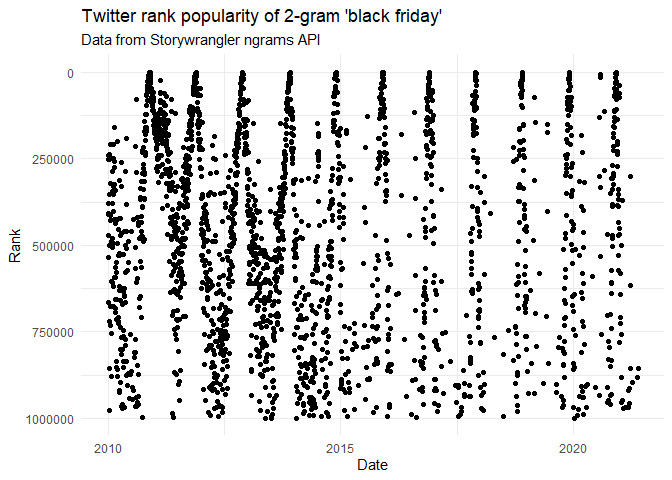

<!-- README.md is generated from README.Rmd. Please edit that file -->

# storywranglr

<!-- badges: start -->
<!-- badges: end -->

This package makes it easy to explore trends in Twitter data using the
Storywrangler application programming interface (API). Data is returned
in a tidy tibble to make it easy to work with and visualize.

For more details about Storywrangler, please see:

-   API documentation: <https://github.com/janeadams/storywrangler>
-   Academic paper describing uses:
    <https://advances.sciencemag.org/content/7/29/eabe6534.full>

## Installation

You can install the released version of storywranglr from
[CRAN](https://CRAN.R-project.org) with:

``` r
install.packages("storywranglr")
```

## Examples

Let’s use `storywranglr::ngrams()` to chart the popularity of the 2-gram
“black friday” over time. Not surprisingly, it looks like there’s an
annual peak around Black Friday.

``` r
library(storywranglr)
library(tidyverse)

result <- storywranglr::ngrams("black friday")

result %>%
  ggplot(aes(x=date, y=rank)) +
  geom_point() +
  theme_minimal() +
  scale_y_continuous(trans = "reverse") +
  labs(title = "Twitter rank popularity of 2-gram 'black friday'",
       subtitle = "Data from Storywrangler ngrams API",
       x = "Date",
       y = "Rank")
```



Now using `storywrangler::zipf()`, let’s find the 10 top 2-grams from
January 6, 2021. “the Capitol” made the top 10, and if we got a longer
list we could expect to see other thematically related terms.

``` r
result <- zipf("2021-01-06", max = 10, ngrams = 2)

knitr::kable(result)
```

| ngram       |   count | count\_no\_rt | rank | rank\_no\_rt |      freq | freq\_no\_rt |     odds | date       |
|:------------|--------:|--------------:|-----:|-------------:|----------:|-------------:|---------:|:-----------|
| of the      | 1327429 |        236481 |    2 |            3 | 0.0026367 |    0.0018889 | 379.2560 | 2021-01-06 |
| in the      | 1116763 |        236362 |    3 |            4 | 0.0022183 |    0.0018880 | 450.7987 | 2021-01-06 |
| the Capitol |  813958 |         43687 |    5 |           75 | 0.0016168 |    0.0003490 | 618.5029 | 2021-01-06 |
| This is     |  684264 |        140136 |    6 |            8 | 0.0013592 |    0.0011193 | 735.7326 | 2021-01-06 |
| to the      |  610598 |        122263 |    8 |           13 | 0.0012129 |    0.0009766 | 824.4956 | 2021-01-06 |
| on the      |  601955 |        114038 |    9 |           15 | 0.0011957 |    0.0009109 | 836.3339 | 2021-01-06 |
| to be       |  588970 |        169747 |   10 |            5 | 0.0011699 |    0.0013559 | 854.7725 | 2021-01-06 |
